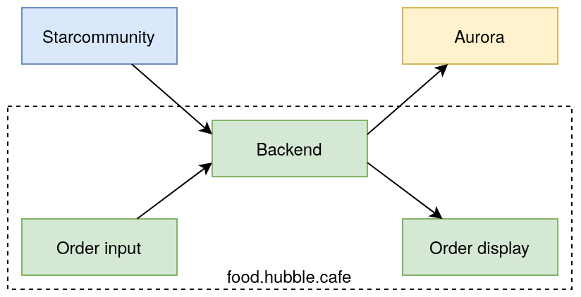

# Hubble Order Manager

Hubble Order manager is responsible for making sure that people know that their food is ready in Hubble. 

Once an order is finished, the kitchen will cross the order off, this is propegated to the [Star Community Project](https://docs.starcommunity.app/). This app receives a message from the Star Community Project. Alternatively, there is also a small webpage in this app where it is possible to put in custom orders. After an order has been received, it is propegated to [Aurora](https://github.com/GEWIS/aurora-core) to be displayed on the poster screens in the room. At the same time, the order is also display on the webpage associated with this app. This webpage can be visited by any customer of Hubble on their phone, where it will continue to receive live updates on new orders that are incoming. The flow is schematically described below. 

The flow of the order after being finished by the kitchen

## System design

### System requirements
1. **Mobile first.** The app must be usuable on your phone in terms of UI and UX, as this is primary source where people will look for their orders.
1. **Reliable.** The app must be reliable and fault tolerant, to make sure the orders are always available for the customers.
1. **Real-time.** The orders must be directly visible in all faucets of the app.

### System architecture
The system is built with [Phoenix Framework](https://www.phoenixframework.org/) in [Elixir](https://elixir-lang.org/). At the heart of the whole is app is a [Phoenix PubSub](https://hexdocs.pm/phoenix_pubsub/Phoenix.PubSub.html) server. This handles all the events. 

#### Live views (order input & display)
The order input and display are [live views](https://hexdocs.pm/phoenix_live_view/Phoenix.LiveView.html) that subscribe and publish to the PubSub server. The will update the pages live to reflect the changes in real time. Phoenix/Elixir handle most of heavy lifting here. 

#### Webhook verification
Webhook verification is done to authenticate the Star Community Project, an signature of the body is verified according to the [docs](https://docs.starcommunity.app/docs/webhooks/signatures) from Star Community.

#### Order propegation
There is also a subscriber that takes order creation events, and calls Aurora to add the order, this is done using the [integration user](https://github.com/GEWIS/aurora-core/tree/develop/src/modules/auth/integration) from Aurora

#### Order removal
Finally, there is a subscriber that schedules the removal of the order after it has been created. This also publishes these events, the live views listen for these and update their views as well. This also allows the order input to delete orders if necessary.

#### Authentication
Authentication is done using a simple token, once authenticated another token is stored in the cookie.

## Changelogs
#### v1.0.0
- Live updating orders
- Backoffice for adding orders
- Order propegation to Aurora

